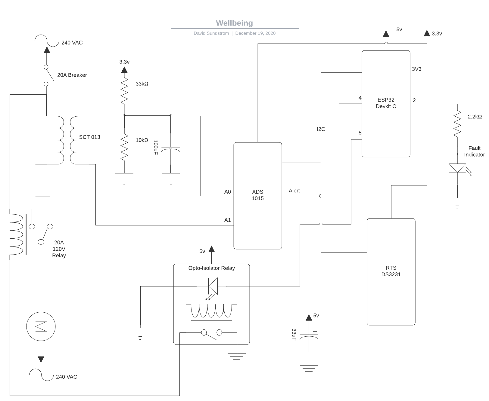
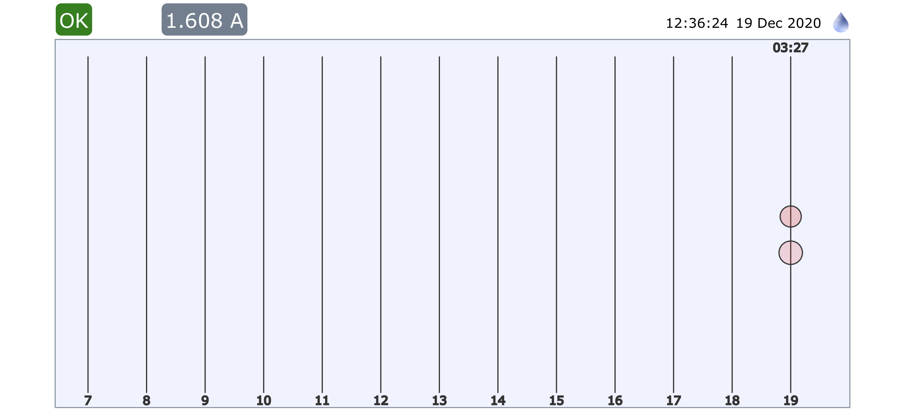
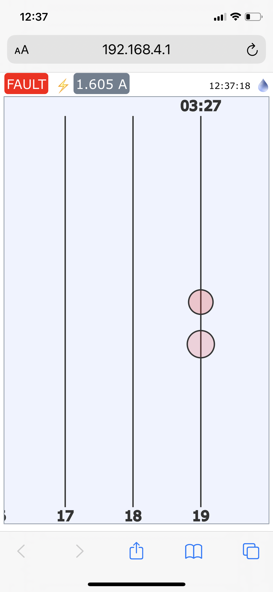
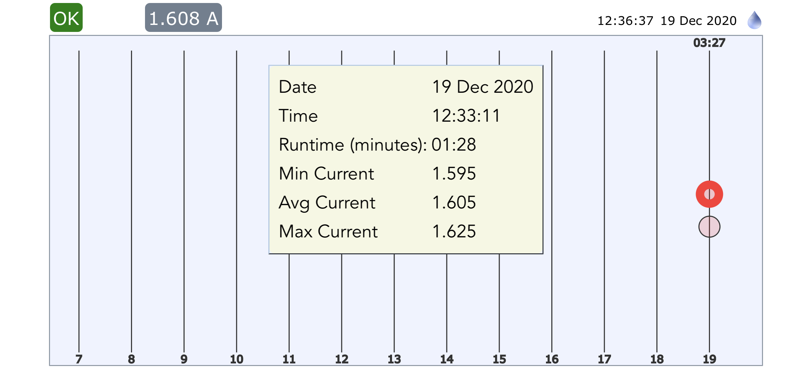
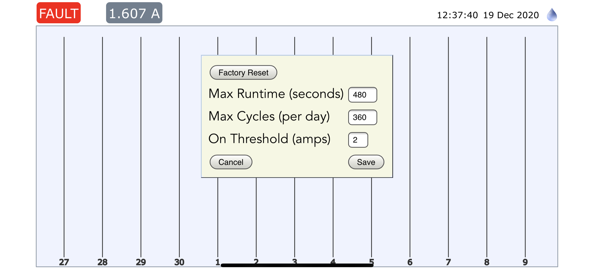
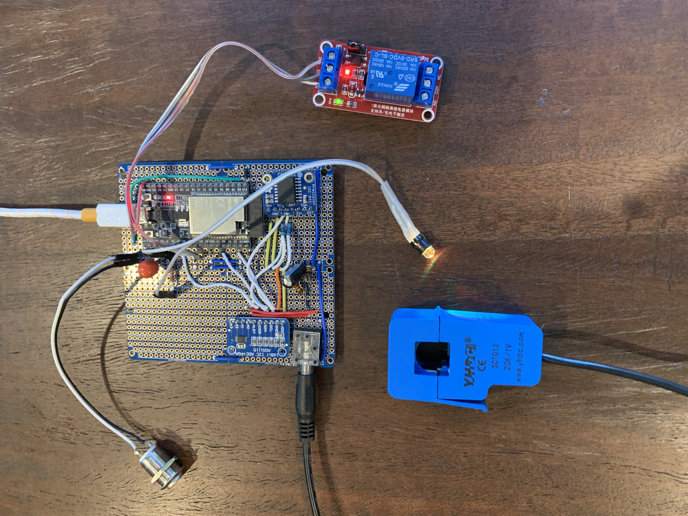

# Wellbeing
> Well pump runtime montior and safety cut-off

Wellbeing is an embedded controller pump monitor, logger, and switch. I built this to monitor a well we have on 
a remote property that isn't visited frequently. The well needs to remain powered on for wildlife and 
some irrigation. This monitor ensures that a leak or malfunction in the well doesn't allow it to run
continuously.

I decided it should also log run times and make those available via a webapp. 
The easiest way to do this was to build a web application I could visit with my phone. There is no
internet at the property so the simplest way to support a number of devices would be a WiFi access
point on the device itself.

## Choosing a Microcontroller

I didn't really spend much time on the board selection. At face value the ESP32 seemed a perfect fit. Built-in WiFi and
analog to DC (ADC) conversion and a real time clock (RTC). Later I discovered:

* The ADC is very noisy
* The RTC rolls over (approx 49.7 days) and is not accurate without an external crystal
* No simple way to have batter backup for the RTC

By the time I discovered these issues I had already written most of the application for the ESP32. I decided to add
an external ADC and and RTC board instead. In retrospect there may have been boards better suited for my purpose.

## Buyer Beware

The external ADS1115 16 bit ADC I got off Amazon had a lower cost 12 bit ADS1015 chip mounted. I didn't discover this until
I had it soldered in and wasted a bunch of time trying to debug code. You wouldn't think someone would bother to
counterfeit a part costing just a few dollars but the problem is becoming common. Order from a reputable supplier. The
savings is not worth your time. The DS5231 board is another commonly counterfeited one. I was more careful on that one
and ordered from Adafruit.

## Choosing a Runtime

You can choose to run the native FreeRTOS runtime or a Arduino port on the ESP32. I chose to run Micropython instead.
Partly because I was using it at work but also because of the excellent web server library from Jean-Christophe Bos 
https://github.com/jczic/MicroWebSrv2. This made implementing the web application, including web sockets trivial 
(with one exception, see below).

## System Diagram



The mains feed to the well is interrupted by a power relay installed inside the mains cabinet. I use a SCT 013 current
transformer around one of the supply lines to measure the current. This transform purports to have a linear 1 VAC output
for 20A wire current. I found it to be pretty linear in testing.

The 1 VAC output of this circuit it biased around 1 VDC so that it presents a +/- 1 VAC differential voltage to the ADC.
The ADC is set up in its 2 volt range. It is run in "continuous" mode for 250 samples per second. Each sample generates
an alert signal to the ESP32 configured to interrupt. And interrupt handler takes the reading and adds it to a list.
Once 240 readins are acquired, it computes the RMS value and then applies a factor to convert the raw reading to amps.
The slope of this linear equation was determined experimentally with a 24VAC transformer and an incandescent bulb,
and by wrapping wire around the current transformer to make measurements at multiple output voltages. 

The mains relay runs at mains voltage including its coil. I use an optically isolated relay to energize its coil from 
the ESP32.

The board is powered by a USB power supply. The ESP regulates the 5 volts to its 3.3 volts. The ADC and RTC boards use
this 3.3v supply. 

## Tricky Bits

The only really tricky bit of this project was the interrupt handler. The Micropython project seems to have only a 
small number of regular contributors. Documentation for technical details can be a little vague. 
The interrupt service routine (ISR) documentation for micropython has all kinds of dire warning about how you must 
implement knowing the internal details of python. But it turns out for the ESP32 port, all it does is schedule work 
onto the Python process. This makes it "safe" from the standpoint of Python. But it creates other non-obvious issues. 
The ISR will execute on whatever python thread is running at the time. Therefore you might find your code interrupted 
at inconvient times, for example, while you are holding a lock. If the ISR code tries to reenter that lock, the Python 
process will deadlock. See https://github.com/jczic/MicroWebSrv2/issues/56 for more details.

## The Web Application

The web application allows you to see when the pump ran, for how long, and at what current draw. It also shows fault
status (if the pump was cut off) and allows you to set runtime limits. All data and configuration are stored in flash
memory in a simple btree database.









Board before mounting into its enclosure. Note the opto-isolator relay is kept separate since it will handle the
 high voltage for the mains relay:



## Other Hints

I used the standard micropython build:

```
esptool.py -p /dev/cu.SLAB_USBtoUART --baud 460800 write_flash -z 0x1000 ~/Downloads/esp32spiram-idf4-20200902-v1.13.bin
```

I used the micropython and ESP32 plugin for IntelliJ PyCharm. But you can just as easily upload to the board with 
the Adafruit "ampy" tool.

I am running the FAT filesystem. It was not clear if it uses write leveling in my micropython build or not. There are
other filesystems that sound better, but it required more work to get files onto the board than I wanted to spend.


